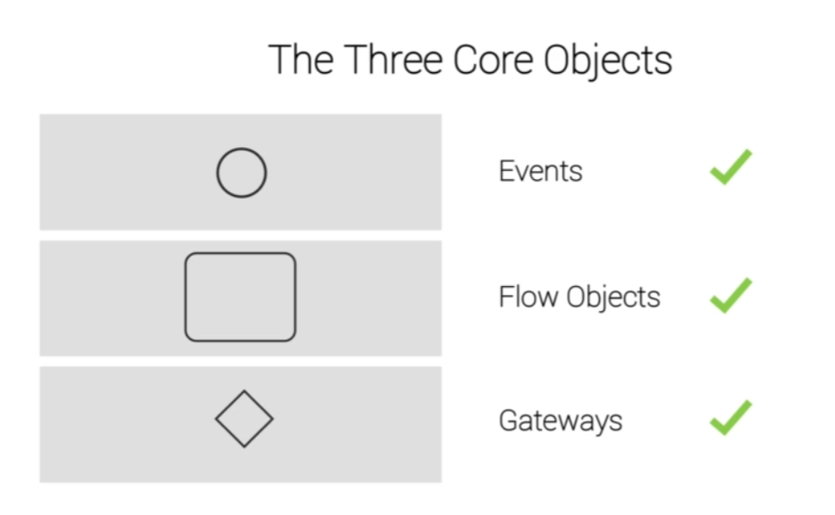
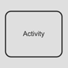
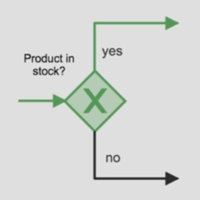
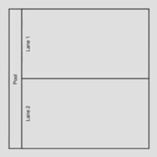
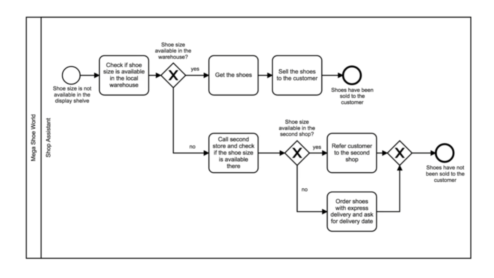
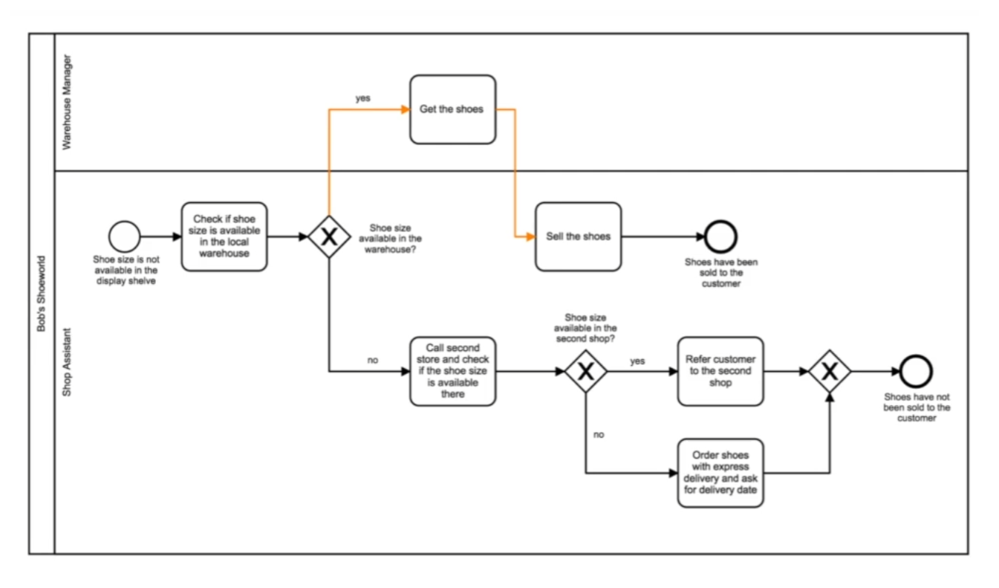
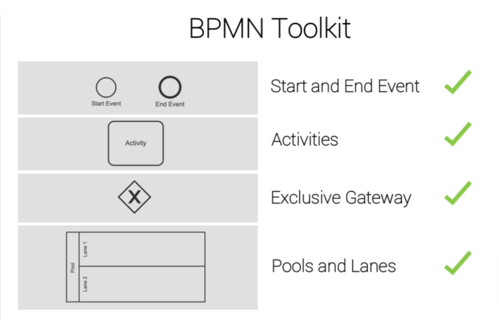
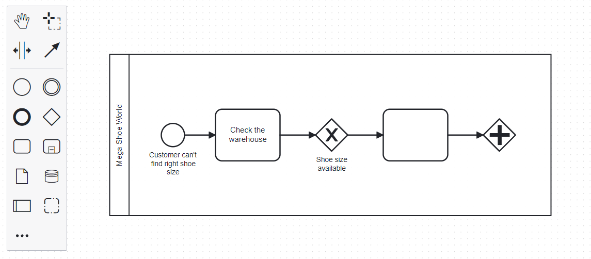

## Section 02: The Shoe Shop

#### Table of Contents

- Introduction
- Theory - Task, Start & End Event, Pools & Lanes
- Practical - Process of Manual Tasks in the Retail Industry (Part 1)
- Practical - Process of Manual Tasks in the Retail Industry (Part 2)
- Summary
- Quiz 1: Quiz
- Tool (BPMN.io) Demo
- Exercise

### Introduction

### Theory - Task, Start & End Event, Pools & Lanes

<table>
<thead>
	<tr>
		<th>Symbol</th>
        <th>Name</th>
		<th>Function</th>
	</tr>
</thead>
<tbody>
	<tr>
		<td></td>
        <td>Start Event</td>
		<td>The Start Event triggers the process</td>
	</tr>
    <tr>
		<td></td>
        <td>End Event</td>
		<td>The End Event defines the state that terminates the process</td>
	</tr>
    <tr>
		<td></td>
        <td>Activity</td>
		<td>An activity or task is a unit of work -- the job to be done</td>
	</tr>
    <tr>
		<td></td>
		<td>Exclusive Gateway</td>
        <td>Defines a decision point</td>
	</tr>
    <tr>
		<td></td>
        <td>Exclusive Gateway (open)</td>
		<td>Only one path can be taken</td>
	</tr>
    <tr>
		<td></td>
        <td>Exclusive Gateway (close)</td>
		<td>
        
Connects branches

        
No logic involved

        </td>
	</tr>
    <tr>
		<td></td>
        <td>Pools and Lanes</td>
		<td>
        
Pools and lanes represent responsibilities for activities in a process

        
Lanes subdivide pools (roles, departments, systems)

        </td>
	</tr>
</tbody>
</table>

### Practical - Process of Manual Tasks in the Retail Industry (Part 1)

#### The Shoe Store

Real Business Process -- All New Concepts Applies

It's Max's first week as a shop assistant. One of Max's customers can't find the
right shoe size! Max wonders how to solve this situation. Max decides to look at
the business process!

#### Missing Show Size Process

### Practical - Process of Manual Tasks in the Retail Industry (Part 2)

Procedures can be communicated in a **clear** and **expressive** way.

Processes change typically because of growth or technological change.

All new Shop Assistants have **no clue** how to handle their new tasks. The
process can also **change because of growth**. For example, a **warehouse
manager** is hired.

### Summary

### Quiz 1: Quiz

#### Question 1:

The Exclusive Gateway defines a decision point.

Correct. The Exclusive Gateway can activate only one path. This means that a
decision needs to be made that determines which path to take.

#### Question 2:

The Closing Exclusive Gateway only forwards the arriving token without applying
any logic.

Correct. The Closing Exclusive Gateway is not very 'smart', it only forwards the
arriving token without applying any logic.

#### Question 3:

Lanes always describe the location where the process takes place.

Correct. Lanes define the resource (Roles, Departments or System) that are
responsible for the execution of the activities that are in the lane.

### Tool (BPMN.io) Demo

www.BPMN.io --> Try Online --> [New Diagram](https://demo.bpmn.io/new)

### Exercise

Max is facing a **new challenge**. He receives a shipment from the wholesaler
and doesn’t know what to do next. His boss tells him:

No worries Max. First you check whether the order and the invoice are correct.
If not, you give the package back to the shipping clerk. If it’s correct you
check if it’s a standard order or if it’s an ordered by a customer. If it’s a
standard order you simply put the shoes into the warehouse. If it’s an order for
a customer, put the shoes behind the cash deck and that’s it!

Your job now is to help Max by **creating a simple process**. Ignore the tasks
of the shipping clerk for now. Just model what Max needs to do.

[Exercise BPMN](./exercise_diagram.bpmn)
