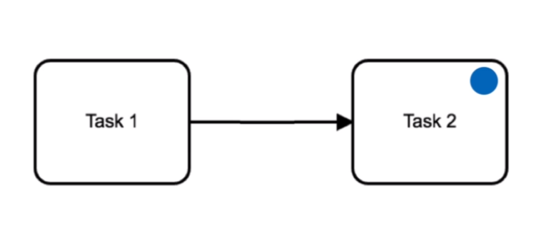
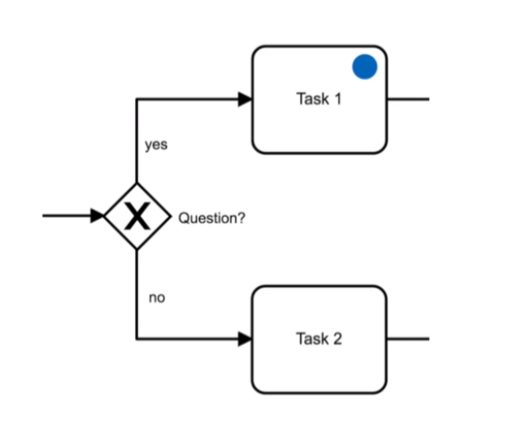
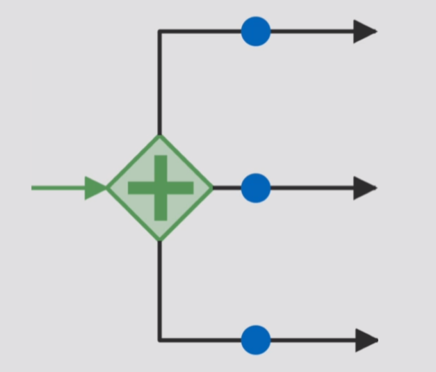
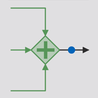
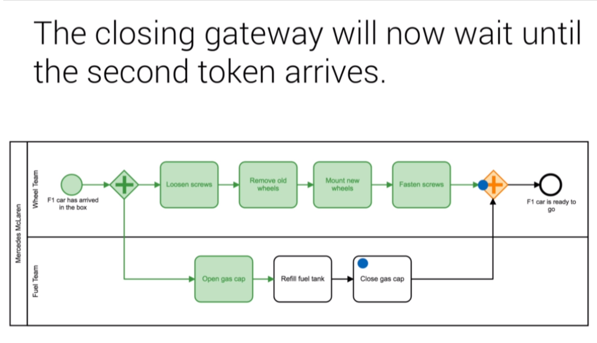
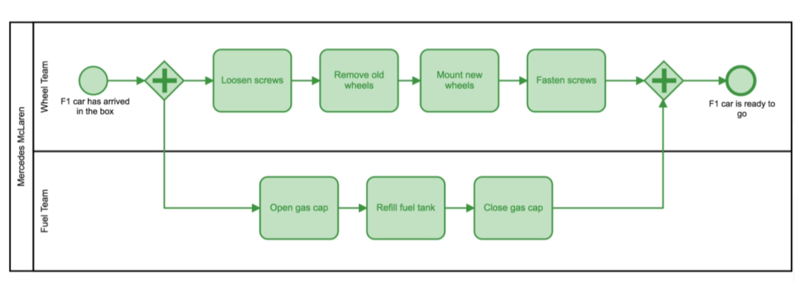
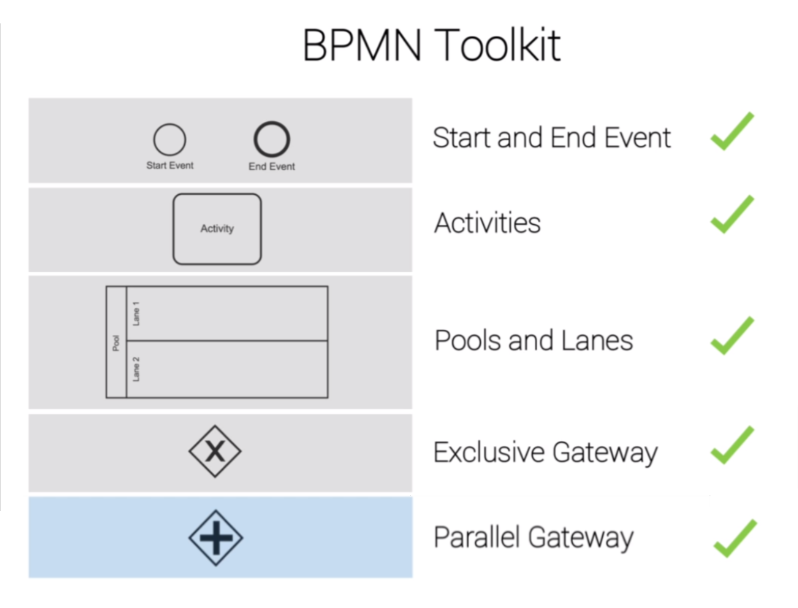

## Section 03: THe Race Track

#### Table of Contents

- Intro Race
- Theory - Token Concept
- Theory - Parallel Gateway
- Practical - Process Racing
- Summary
- Quiz 2: Quiz
- Exercise

### Intro Race

### Theory - Token Concept

Imagine the token as a ball or marble. The token rolls through the process, from
start to end event. The **token** passes all kinds of tasks and gateways that
impact it.

The real **strength** of the **token concept** is to **visualize** how different
**gateways** work. The token follows the selected path.

### Theory - Parallel Gateway

<table>
<thead>
	<tr>
		<th>Symbol</th>
        <th>Name</th>
		<th>Function</th>
	</tr>
</thead>
<tbody>
	<tr>
		<td></td>
        <td>Parallel Gateway</td>
		<td>
        
No decision making

        
All outgoing branches are activated

        </td>
	</tr>
    <tr>
		<td></td>
        <td>Parallel Gateway (open)</td>
		<td>
        
The token is cloned

        
One cloned token per outgoing branch

        </td>
	</tr>
    <tr>
		<td></td>
        <td>Parallel Gateway (close)</td>
		<td>
        
All tokens are merged into one

        </td>
	</tr>
</tbody>
</table>

Build **mental bridges** to clearly **distinguish** the **gateways**.

### Practical - Process Racing

To become the champion Gonzales has to win today. Gonzales' team has to do the
following simultaneously:

- change the tires
- fill up the fuel tank

### Summary

The **token concept empowers** you to understand **even** complex business
processes.

### Quiz 2: Quiz

#### Question 1:

The Parallel Gateway defines a decision point.

Correct. The Parallel Gateway always activates all paths. This means that no
decision is made.

#### Question 2:

The Closing Parallel Gateway waits until all tokens have arrived and then merges
all token into one.

Correct. ​The Closing Parallel Gateway waits for all incoming tokens. When all
of them have arrived it merges them into one​. After that, the token gets
forwarded and the process continues.

### Exercise

**Gonzales has an idea**. As his fuel team acted a bit slow the last time, he
talks to his manager and tells him:

When I arrive at the box, both teams start to work in parallel as usual. The
wheel team simply changes the wheels. The fuel team however, first checks how
many rounds are left. If 5 or less rounds are left, the fuel team will fill only
half of the gas tank. If more than 5 round are left, the entire gas tank needs
to be filled. So the fuel refill is faster when 5 or less rounds are left.

Your job now is to help the head of mechanics to map the process so he can
**effectively communicate** the procedure with his team.

[Exercise BPMN](./exercise_diagram.bpmn)
