## Section 04: The Beauty Paradise

#### Table of Contents

- Intro
- Theory - Inclusive Gateway
- Theory - Collapsed Pools
- Theory - Message Event
- Theory - Plain Intermediate Event
- Practical - Beauty Process (Part 1)
- Practical - Beauty Process (Part 2)
- Summary
- Quiz 3: Quiz
- Exercise

### Intro

### Theory - Inclusive Gateway

<table>
<thead>
	<tr>
		<th>Symbol</th>
        <th>Name</th>
		<th>Function</th>
	</tr>
</thead>
<tbody>
	<tr>
		<td></td>
        <td>Inclusive Gateway</td>
		<td>
        
Defines a decision

        </td>
	</tr>
    <tr>
		<td>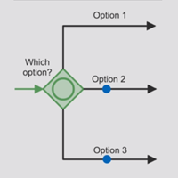</td>
        <td>Inclusive Gateway (open)</td>
		<td>
        
Any combination of paths can be taken

        
One cloned token per outgoing branch

        </td>
	</tr>
    <tr>
		<td>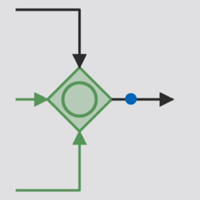</td>
        <td>Inclusive Gateway (close)</td>
		<td>
        
Waits for all active inputs

        
Is informed about all preceding token flows

        </td>
	</tr>
</tbody>
</table>

### Theory - Collapsed Pools

<table>
<thead>
	<tr>
		<th>Symbol</th>
        <th>Name</th>
		<th>Function</th>
	</tr>
</thead>
<tbody>
	<tr>
		<td>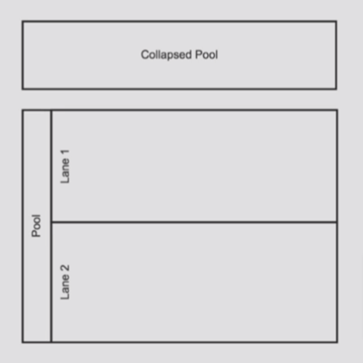</td>
        <td>Collapsed Pool</td>
		<td>
        
Don't show the process flow -- like a black box

        
Collapsed Pools are used to represent external process participants

        </td>
	</tr>
</tbody>
</table>

### Theory - Message Event

<table>
<thead>
	<tr>
		<th>Symbol</th>
        <th>Name</th>
		<th>Function</th>
	</tr>
</thead>
<tbody>
	<tr>
		<td>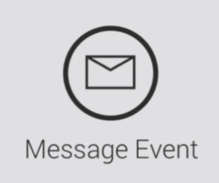</td>
        <td>Message Event</td>
		<td>
        
Represents incoming or outgoing messages

        
Is also used for the sending or receiving goods, money or other things

        </td>
	</tr>
</tbody>
</table>

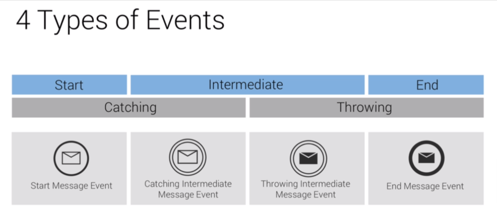

#### Why do we need 4 different types of message event?

A message can be **sent** or **received**, and occur at **different stages**.

**Start** means that the process is started with the event. This event has a
single thin border identical to the plain start event you already know.

**Intermediate** events occur within our process flow, so somewhere between the
start and end event. Here we also distinguish between catching and throwing
message events.

The **Catching** Intermediate message event stands for incoming messages, so
they literally catch a message as soon as it comes in.

The **Throwing** Intermediate event defines an outgoing message. For example,
you can use this event when you send a confirmation to a customer at the end of
the process, you can also use a message event.

The **End** message event is always throwing. So if your process is completed
with a shipment of a good, the end message event is the perfect choice.

Let's briefly apply this right away to a small process.

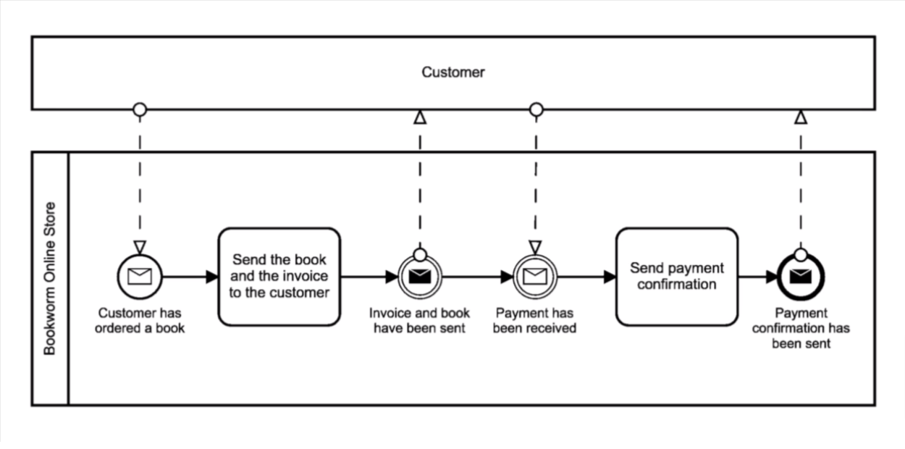

**Tasks** and **events** are fundamentally different! The **Task** describes the
**action** of sending the book & invoice. The **Event** states that book &
invoice have been sent. **No actions** are taken! It simply determines that the
shippment has happened. The **throwing** intermediate event is **"nice to
have"**. The **catching** intermediate event is crucial to the process flow as
it defines a **waiting point**. The process will wait until the payment has been
received, so it might happen that the process gets stuck here until the customer
has paid the invoice.

### Theory - Plain Intermediate Event

The plain start and end events can be added to the event overview. There also
exists a third plain event which is called **Plain Intermediate** Event. The
plain intermediate event is mostly used to visualize a milestone. The tokens
simply rolls through this event without influencing the process flow.

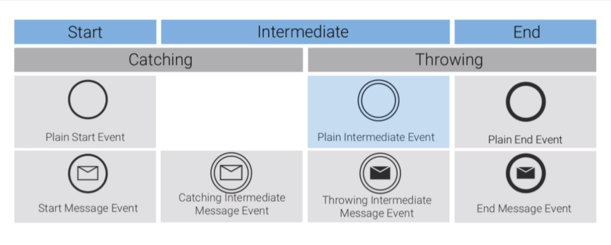

#### Plain Event Example

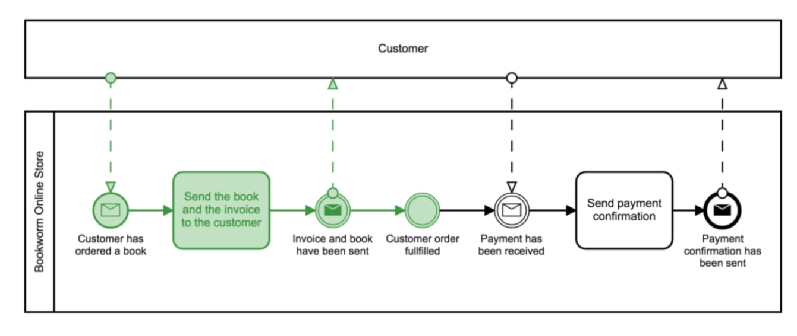

A plain intermediate event is added to the order process of the Bookworm store
and labelled with "customer order fulfilled". This defines an important
milestone in our process. As soon as the token reaches the milestone, it will
roll directly through the event, which sets the state of the order to customer
order fulfilled.

### Practical - Beauty Process (Part 1)

The process takes place in the **"Beauty Paradise"**, a large cosmetics
manufacturer. Susan is responsible for customer satisfaction. As part of her
job, she responds to **customers** who ask for a **product sample**. This
procedure is very repetitive, and Susan wants to assess whether some parts can
be automated to free up precious time for her other responsibilities. In
general, the **documentation** of the process is the first step to **improve**
and especially **automate it**. So that's why Susan already documented her
current process, which you see here.

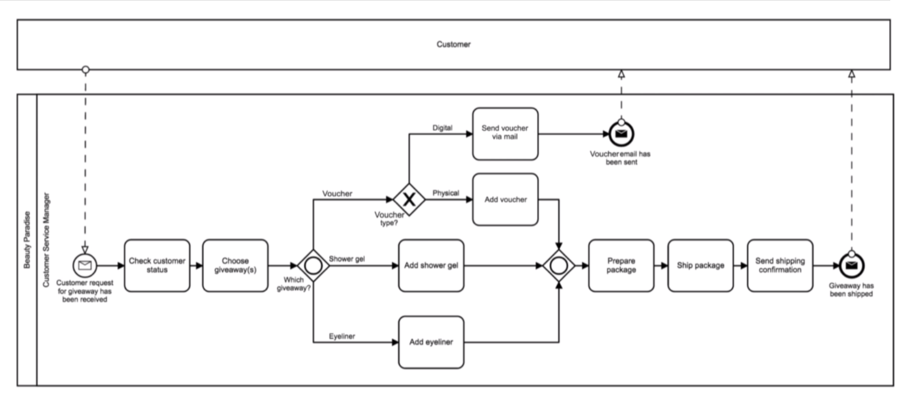

Susan selects both Shower gel and Eyeliner for giveaways.

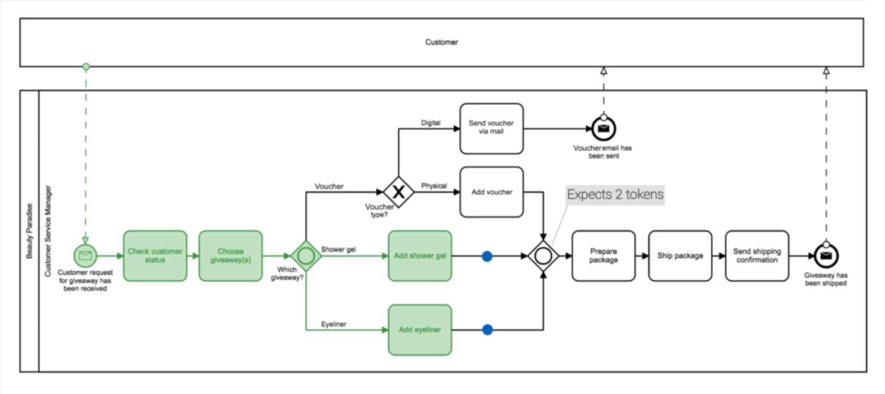

The **closing inclusive gateway** was **only informed once**. Assumption:
inclusive gateways **only communicate between each other**. This assumption is
wrong. It is possible that the **number of expected tokens changes** after the
opening inclusive gateway has already informed its counterpart. This becomes
relevant when Susan selects a voucher.

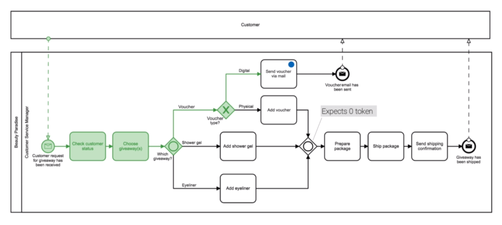

### Practical - Beauty Process (Part 2)

Susan selects all three giveaways.

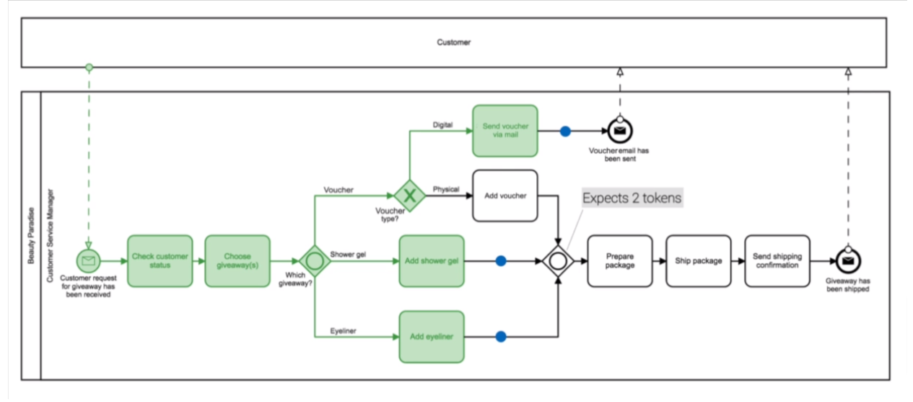

What consequences follow for the process Logic? After the shower gel and the
eyeliner token are merged again. We still have two tokens circulating, heading
towards two separate events. This situation is ALLOWED. The **process doesn't
end with the first end event** being activated. It is not a token race, where
**both tokens have to arrive** at their end events to complete the process.
Here, this process shows that the customer gets a package and an email. Why do
we need to define **two separate end events**? Both end events define **distinct
situations** which lead to **different** follow up **activities**. This means
when shipping the giveaways, **activities** like **"paying the shipping
company"** and **"tracking the package"** are following. Clearly this **doesn't
need to be done**. If Susan just sends an email again in one sentence, we need
to end events because each of them triggers a very different follow up
activities.

### Summary

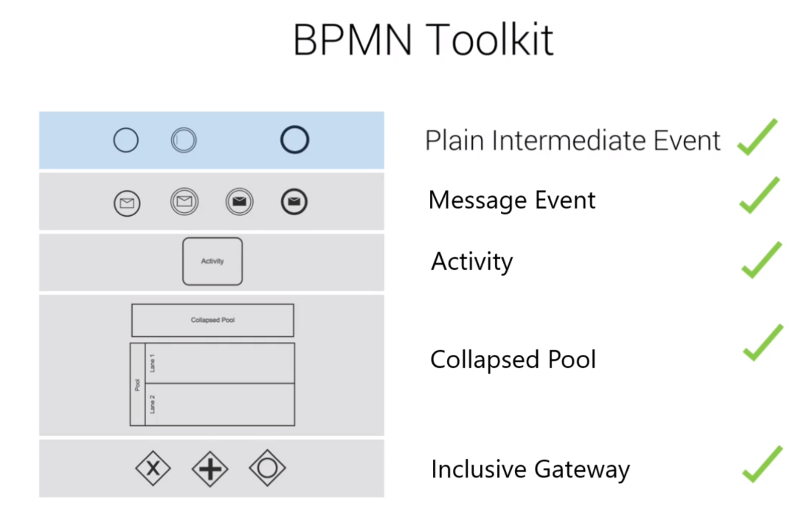

### Quiz 3: Quiz

#### Question 1:

The Inclusive Gateway can only activate only a single path.

Incorrect. The Inclusive Gateway can activate any path(s) (apart from activating
zero paths). Therefore, one possible option is the activation of one path.

#### Question 2:

The Inclusive Gateway defines a decision point.

Correct.

### Exercise

Susan is still keen on further optimizing the customer experience! Therefore,
she chats with her boss and tells him that **she wants to develop a new
process** that works like this:

After the sample has been sent, I will dispatch a product catalogue to the
customer. We have only 2 product catalogues. I will check which samples I've
sent to the customer. If he or she got a cosmetic product, I'll send our
cosmetic catalogue. If he or she got a voucher, I'll send our standard
catalogue. If he or she received both, I'll send both catalogues. After that,
I'll document the catalogue shipment in our CRM system.

Your job now is to **map this new process** so Susan can effectively communicate
the procedure with her team.


[Exercise BPMN](./exercise_diagram.bpmn)
