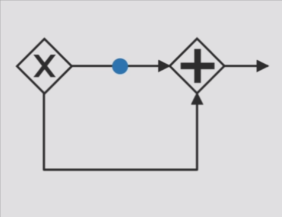
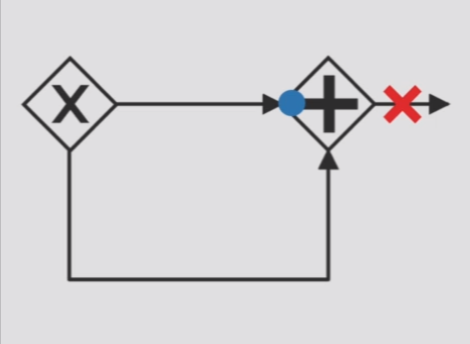
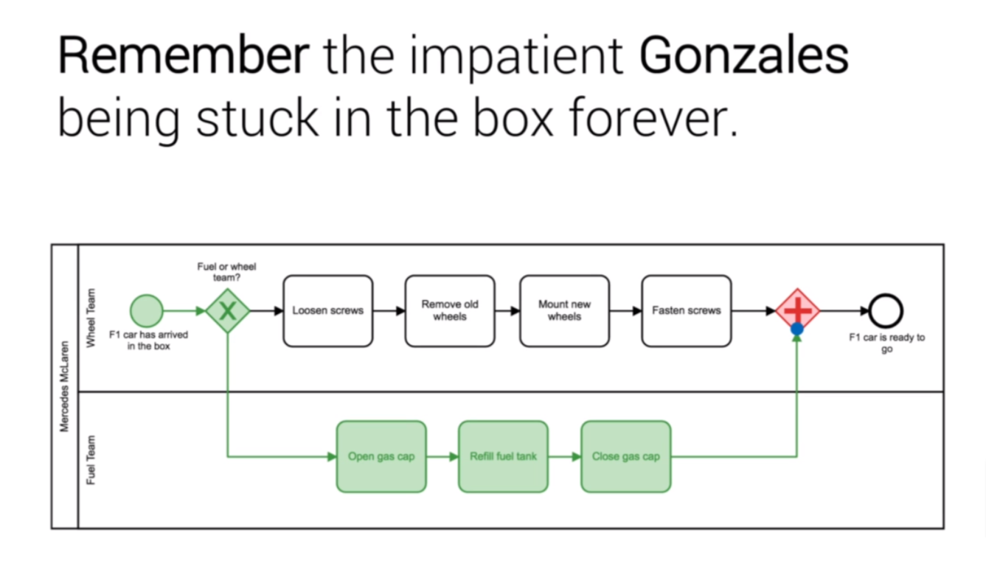

## Section 05: BPMN Traps

#### Table of Contents

- Introduction
- The Deadlock
- The Multimerge
- Summary
- Quiz 4: Quiz

### Introduction

### The Deadlock

The traps are caused by mixing up the gateways.

<table>
<thead>
	<tr>
		<th>Symbol</th>
        <th>Name</th>
		<th>Function</th>
	</tr>
</thead>
<tbody>
	<tr>
		<td></td>
        <td>The Deadlock</td>
		<td>
        <ul>
            <li>Opening Exclusive Gateway</li>
            <li>Closing Parallel Gateway</li>
            <li>One Token is issued</li>
        </ul>
        </td>
	</tr>
    <tr>
		<td></td>
        <td>The Deadlock</td>
		<td>
        <ul>
            <li>Two Tokens are expected</li>
            <li>The process gets stuck</li>
        </ul>
        </td>
	</tr>
</tbody>
</table>

### The Multimerge

### Summary

### Quiz 4: Quiz
